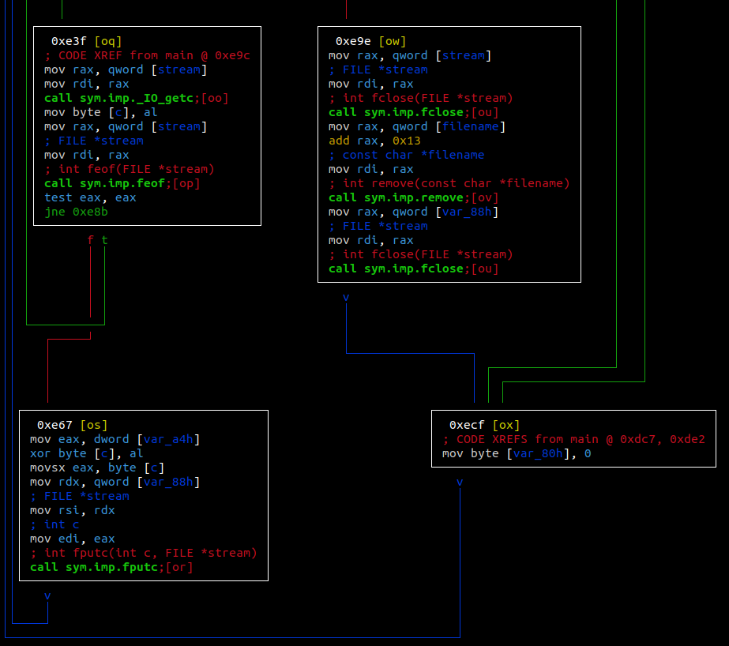
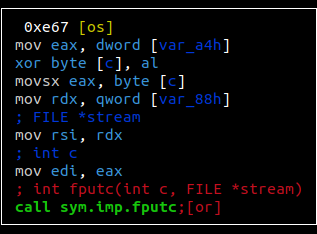

# baby_ransomeware
    Abstract: The binary performs a simple XOR-19 encryption on all files
within the current directory with filenames differing from its own. Since
XOR is its own inverse, we can decrypt all the files easily by performing
XOR again. (Funny enough, this means running the binary twice will decrypt
the files, too).

# Recon

Opening up the binary in radare2, we see that it goes through all the
directory entries using `readdir()` and reads them individually with
a series of `fgetc()`. Specifically, we want to look at the following:

Here we see the current byte value read from the source file being
XOR'ed with the value in `var_a4h` and put into the destination file.
Since there is nothing else going on, we want to find out what value is
in `var_a4h` (Again, we can note that XOR is its own inverse and at this
point just run the binary again). The binary uses `rand()` to determine
this value but since we know the seed we can follow through each step to 
get the final value.
Or, we can also step through the program in radare2 and print the value
after the calculations. Either method gives us the value 19.

So now we can write the solution, `sol.c` it will expect the encrypted file
as its first argument, and spit out a copy of the original file.
