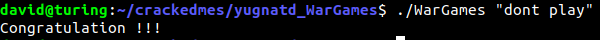
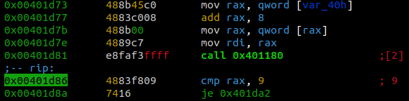
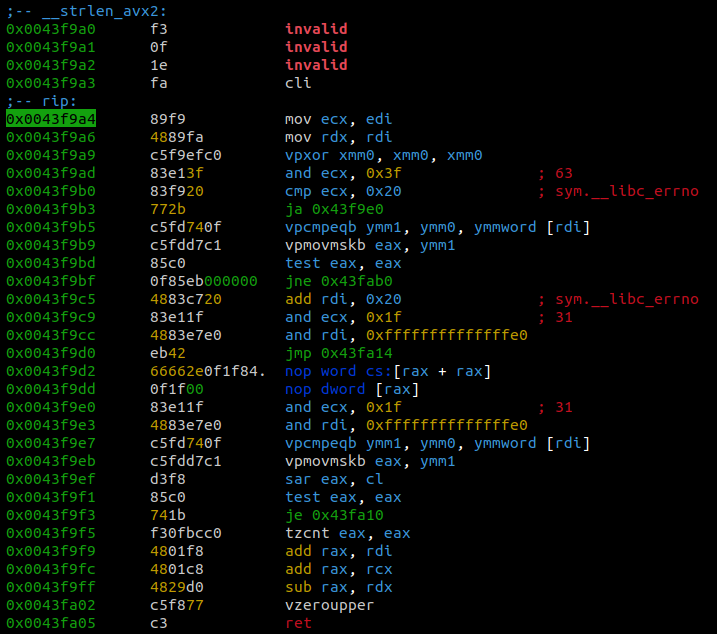
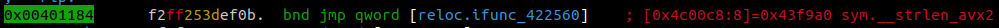

# Abstract
After manually locating the main function, we find the argument passed
is compared to a local string, offset by a sequence of random numbers.
Since the seed is known, these offsets can be determined and applying
them to the local string gives us the password: "dont play".

# Notes
The binary has a rather large number of plaintext strings inside of it.
Running `strings` returns a lot of info that does not seem particularly
relevant.

Radare2 seemed to have difficulty analyzing and finding the main function
for this binary. Using `objdump -D Wargames`, we see that the main function
has two calls to `puts()`, one to `srand()`, and `rand()`. With a function 
prelude analysis (aap) and going through each function individually, we find 
that fcn.00401d39 matches this description.

the jump preceeding the goal is determined by if a variabe - key - is set
to 0. At 0x00401e57, key is set to 1 so this step must be jumped over.
Key must also be set to 0 before this.

There's a weird function that immediately gives us the "wrong password"
end if the value returned by it is not 9. Looking at the function gives
us an annoying amount of weird instructions, such as a nop with arguments.
Messing around with the debugger, it seems as if this function simply
returns the length of the string argument passed to it. Since entering the
function also has us jump to a label with \_\_strlen\_xva2, we can assume
that this is the strlen function for now.

Immediately following this check is a relatively large number of operations
doing weird bit shifting, multiplication, adding, subtracting and so on.
There is a loop, and it exits when some counter variable greater than 8.
I couldn't follow this by hand, so I had to open up ghidra and use the
overpowered decompiler to have a clue as to what was going on.

It seems as if it checks the given password against
"gssw#tpc", but each character offset by a sequence of random negative numbers
between 1 and 5. However, the seed is known so we can deduce the sequence
of offsets to be [-3, -4, -5, -3, -3, -4, -4, -2, -1]. This is applied
to the string "gssw#tpc", giving us the password: "dont pla" and an
unprintable character. It should be noted that the given string is only
8 characters long, but the loop goes for 9, meaning that the last character
would be 0 -1 == -1 is invalid. However, since the local variable
var\_011h is located right after the string in memory, the check actually
occurs on var\_011h, and so we get the full original string, "gssw#tpcz",
and "dont play".
